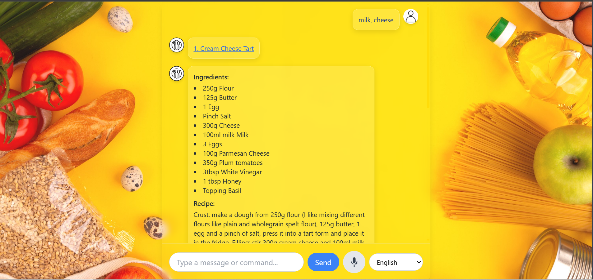

## Voice-Based Recipe Filtering Application
Speech-driven application that filters recipes based on spoken or recorded ingredient lists.

- Audio input support for user interaction.
- Speech-to-text processing to extract ingredient names.
- Filtering and displaying recipes containing all specified ingredients.
- User-friendly interface for intuitive use.
- Language detection and translation
- Excess ingredient filtering

